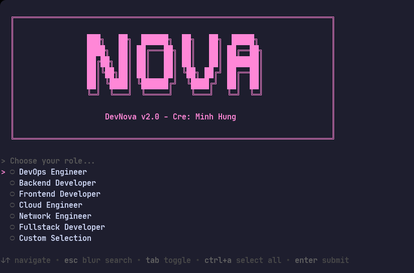
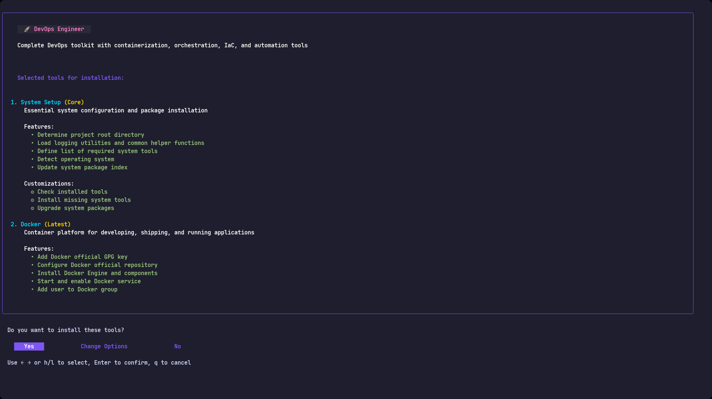
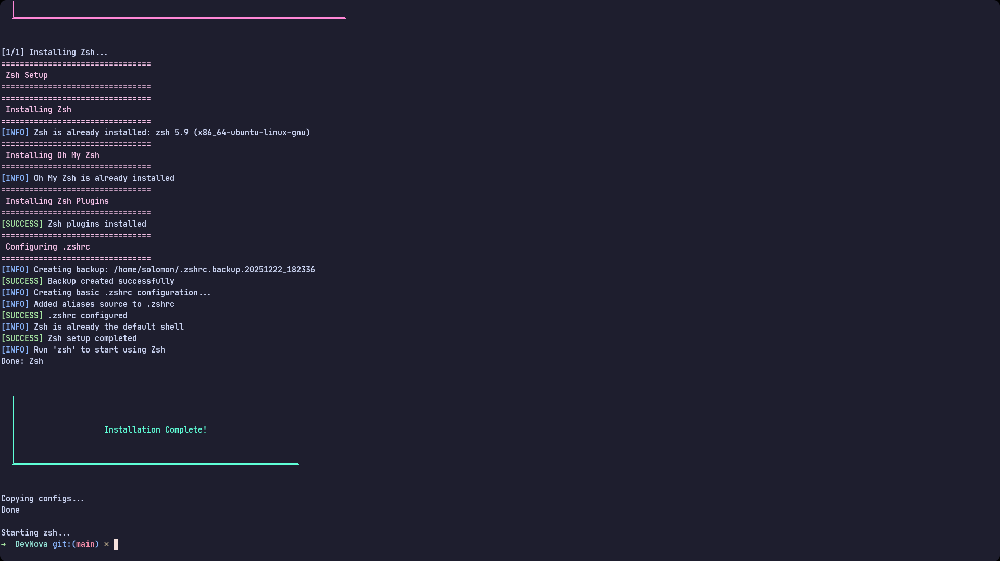
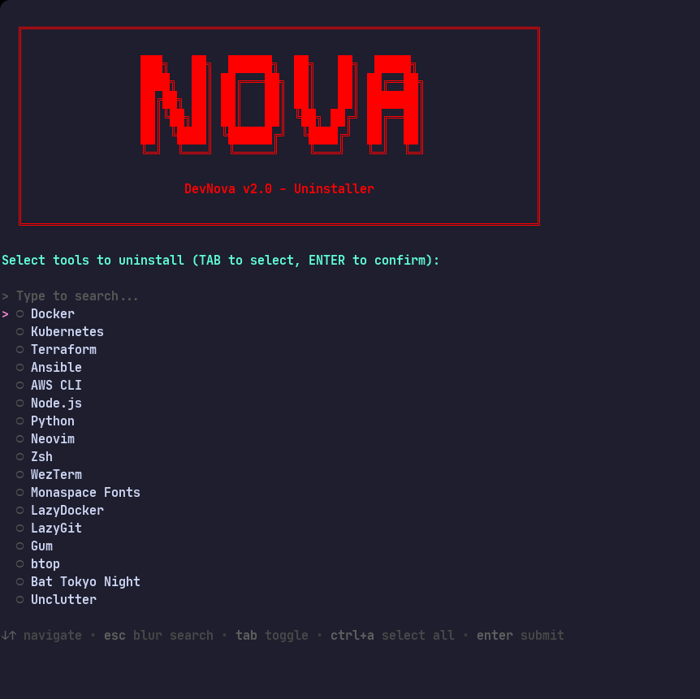

<h4 align="center">Automated development environment setup CLI tool for Linux with beautiful interactive interface</h4>

<p align="center">
  <a href="https://opensource.org/licenses/MIT">
    
  </a>
  <a href="https://github.com/henrynguci/DevNova">
    
  </a>
  <a href="https://www.gnu.org/software/bash/">
    
  </a>
  <a href="https://go.dev/">
    
  </a>
</p>

<p align="center">
  <a href="#-overview">Overview</a> •
  <a href="#-features">Features</a> •
  <a href="#-requirements">Requirements</a> •
  <a href="#-installation">Installation</a> •
  <a href="#-usage">Usage</a> •
  <a href="#-license">License</a>
</p>



---

## 📑 Table of Contents

- [📖 Overview](#-overview)
- [✨ Features](#-features)
  - [🎭 Role-based Installation](#-role-based-installation)
  - [🛠️ Rich Toolset](#️-rich-toolset)
  - [🌺 Installation Complete](#-installation-complete)
  - [🗑️ Easy Uninstallation](#️-easy-uninstallation)
- [📋 Requirements](#-requirements)
  - [Supported Operating Systems](#supported-operating-systems)
  - [Dependencies](#dependencies)
- [🚀 Installation](#-installation)
- [📚 Usage](#-usage)
  - [Basic Installation](#basic-installation)
  - [Custom Installation](#custom-installation)
  - [Uninstallation](#uninstallation)
  - [Installed Configurations](#installed-configurations)
  - [Updating DevNova](#updating-devnova)
- [🤝 Contributing](#-contributing)
- [♠️ License](#️-license)
- [🐑 Author](#-author)
- [♥️ Acknowledgments](#️-acknowledgments)
- [💞 Support](#-support)

---

## 📖 Overview

**DevNova** is a powerful CLI tool designed to automate the installation and configuration of development environments on Linux. Instead of manually installing each tool separately, DevNova provides a friendly interactive interface that helps you select and install the entire technology stack suitable for your role in just a few minutes.

---

## ✨ Features

DevNova uses [Gum](https://github.com/charmbracelet/gum) and [Bubble Tea](https://github.com/charmbracelet/bubbletea) to create a modern, colorful, and easy-to-use CLI interface.


### 🎭 Role-based Installation

Choose your role and DevNova will automatically suggest the appropriate toolset:

- **DevOps Engineer**: Docker, Kubernetes, Terraform, Ansible, AWS CLI, Python, Neovim, Zsh, LazyDocker, LazyGit, Gum, btop, Bat Tokyo Night, Unclutter
- **Backend Developer**: Docker, Node.js, Python, Neovim, Zsh, LazyDocker, LazyGit, Gum, btop, Bat Tokyo Night, Unclutter
- **Frontend Developer**: Node.js, Neovim, Zsh, LazyGit, Gum, btop, Bat Tokyo Night, Unclutter
- **Cloud Engineer**: Docker, Kubernetes, Terraform, AWS CLI, Python, Neovim, Zsh, LazyDocker, Gum, btop, Bat Tokyo Night, Unclutter
- **Network Engineer**: Docker, Ansible, Python, Neovim, Zsh, Gum, btop, Bat Tokyo Night, Unclutter
- **Fullstack Developer**: Docker, Kubernetes, Node.js, Python, Neovim, Zsh, WezTerm, Monaspace Fonts, LazyDocker, LazyGit, Gum, btop, Bat Tokyo Night, Unclutter
- **Custom Selection**: Freely choose the tools you want



### 🛠️ Rich Toolset

DevNova supports installation of 17+ popular development tools:

**Core Infrastructure:**
- Docker & Docker Compose
- Kubernetes (kubectl, minikube, helm)
- Terraform
- Ansible
- AWS CLI

**Development Tools:**
- Node.js (via NVM)
- Python (via pyenv)
- Neovim with optimized configuration
- WezTerm terminal emulator
- Monaspace Fonts

**Productivity Tools:**
- Zsh with Oh My Zsh
- LazyDocker - Docker UI in terminal
- LazyGit - Git UI in terminal
- Gum - CLI interaction tool
- btop - System monitor
- Bat with Tokyo Night theme
- Unclutter - Auto hide mouse cursor

### 🌺 Installation Complete



### 🗑️ Easy Uninstallation

DevNova provides an uninstallation script with a similar interface, allowing you to select and remove tools that are no longer needed.



---

## 📋 Requirements

### Supported Operating Systems

- **Ubuntu** 20.04 LTS or later
- **Debian** 11 or later
- Linux distributions based on Debian/Ubuntu

### Dependencies

- **Go** 1.24.0+
- **Gum** (will be installed automatically if not present)

---

## 🚀 Installation

### Step 1: Clone the repository

```bash
git clone https://github.com/henrynguci/DevNova.git
cd DevNova
```

### Step 2: Build CLI tools

DevNova uses some custom CLI tools written in Go. Build them before installation:

```bash
chmod +x build.sh
./build.sh
```

This script will:
- Check if Go is installed
- Build the binaries: `role-confirm`, `custom-confirm`, `tool-info`
- Save the binaries to the `bin/` directory

### Step 3: Install Gum (if not already installed)

Gum is a required dependency for the interactive interface:

```bash
sudo ./install.sh --install-gum-only
```

### Step 4: Run the installer

```bash
./install.sh
```

### Step 5: Follow the installation process

1. Select your role from the menu
2. Confirm the list of tools to be installed
3. Wait for the installation to complete
4. Enjoy your new development environment!

---

## 📚 Usage

### Installation

```bash
./install.sh
```

### Uninstallation

```bash
./uninstall.sh
```

### Installed Configurations

After installation, configurations will be copied to `~/.config/`:

- **Neovim**: `~/.config/nvim/`
- **WezTerm**: `~/.config/wezterm/`
- **LazyDocker**: `~/.config/lazydocker/`
- **LazyGit**: `~/.config/lazygit/`
- **btop**: `~/.config/btop/`
- **Zsh**: `~/.zshrc`, `~/.oh-my-zsh/`

### Updating DevNova

```bash
cd DevNova
git pull origin main
./build.sh
```

---

## 🤝 Contributing

Contributions are welcome! If you'd like to contribute:

1. Fork the repository
2. Create a feature branch (`git checkout -b feature/AmazingFeature`)
3. Commit your changes (`git commit -m 'Add some AmazingFeature'`)
4. Push to the branch (`git push origin feature/AmazingFeature`)
5. Open a Pull Request

---

## ♠️ License

This project is distributed under the MIT License. See the [LICENSE](LICENSE) file for more details.

---

## 🐑 Author

**Minh Hung**

- GitHub: [@henrynguci](https://github.com/henrynguci)

---

## ♥️ Acknowledgments

- [Gum](https://github.com/charmbracelet/gum) - Glamorous shell scripts
- [Bubble Tea](https://github.com/charmbracelet/bubbletea) - TUI framework
- [Lipgloss](https://github.com/charmbracelet/lipgloss) - Style definitions for nice terminal layouts

---

## 💞 Support

If you encounter any issues or have questions, please:

- Open an [Issue](https://github.com/henrynguci/DevNova/issues) on GitHub
- Check [Discussions](https://github.com/henrynguci/DevNova/discussions) for frequently asked questions

---

<div align="center">

**⭐ If you find this project useful, don't forget to give it a star! ⭐**

Made with ❤️ by Minh Hung

</div>
