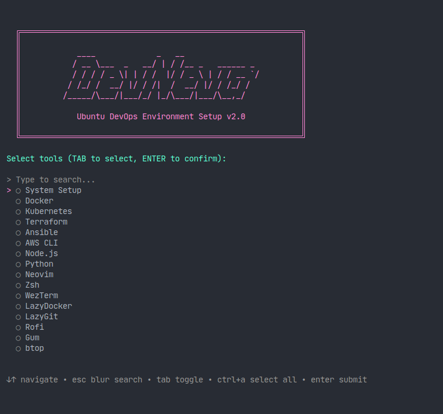
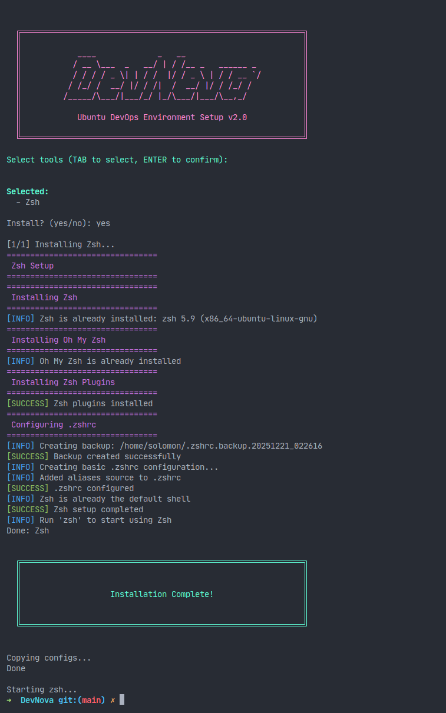

# DevNova

Ubuntu DevOps Environment Setup - Automated installation toolkit with beautiful TUI



## Quick Start

```bash
git clone https://github.com/henrynguci/DevNova.git
cd DevNova
./install.sh
```

## Features

### Core DevOps Tools
- Docker & Docker Compose
- Kubernetes (kubectl, minikube)
- Terraform
- Ansible
- AWS CLI

### Development Tools
- Node.js, npm & Yarn
- Python 3 & pip
- Neovim with LSP
- WezTerm
- LazyDocker & LazyGit
- Rofi
- btop

### Shell Environment
- Zsh & Oh My Zsh
- 100+ DevOps aliases
- Auto-suggestions & syntax highlighting

## Installation



The installer features:
- Interactive tool selection with fuzzy search
- Real-time progress tracking
- Automatic configuration deployment
- Auto-start Zsh after completion

## Available Tools

- System Setup
- Docker
- Kubernetes
- Terraform
- Ansible
- AWS CLI
- Node.js
- Python
- Neovim
- Zsh
- WezTerm
- LazyDocker
- LazyGit
- Rofi
- Gum
- btop

## License

MIT License

## Author

Minh-Hung Trinh
- Email: moingucidev@gmail.com
- GitHub: [@henrynguci](https://github.com/henrynguci)
